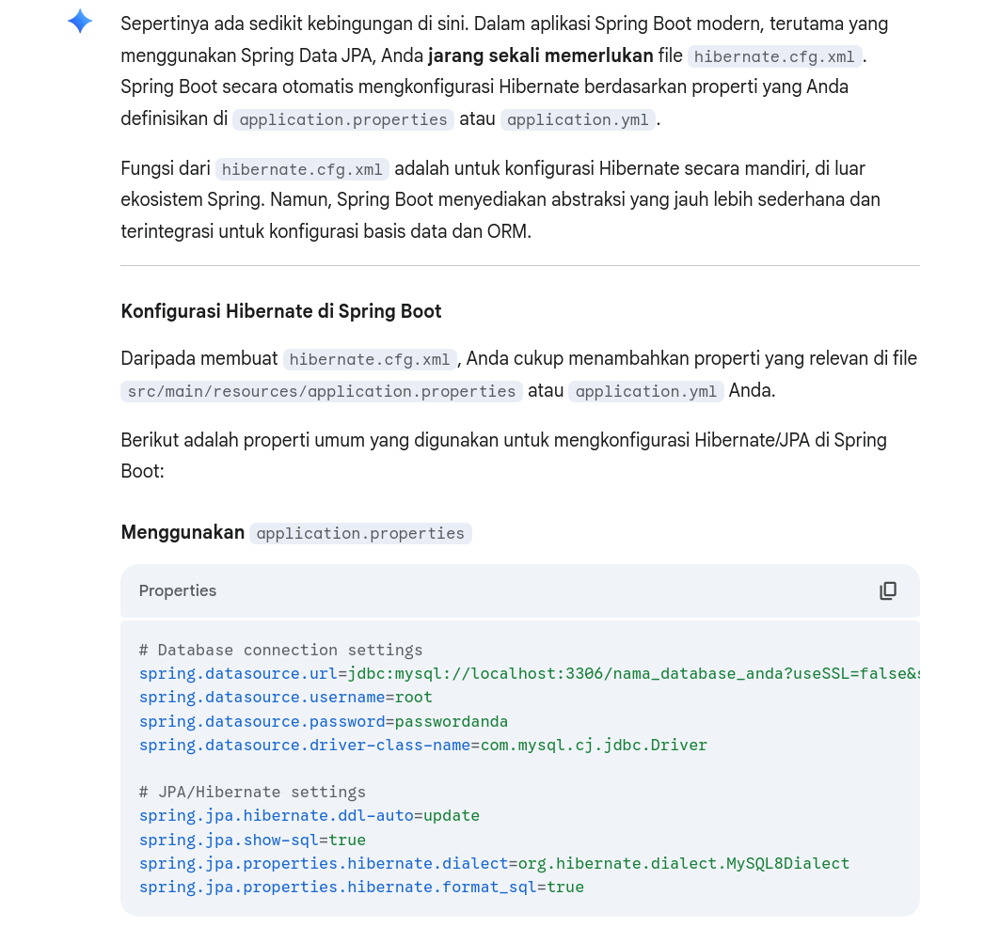

# Deliverables Backend W3

> Kelompok : 2

- [X] `database_schema.sql`
- [X] `erd-diagram.png`
- [X] `hibernate.cfg.xml`
- [X] `/entity/`
- [X] github repo
- [X] `owasp-checklist.xlsx`
- [x] `Jenkinsfile`
- [X] `deployment-report.pdf`

## Database Schema

### Customer Database

`customer_registration` merupakan database utama tempat menyimpan informasi nasabah yang melakukan registarsi (_on-boarding_). Terdapat tiga tabel di dalam database ini yaitu `customers`, `alamat`, dan juga `wali`.

- `customers` : menyimpan detail informasi calon nasabah seperti nama lengkap, jenis kelamin, dan sebagainya.
- `alamat` : menyimpan detail informasi alamat nasabah : mulai dari nama jalan, provinsi, hingga kode pos.
- `wali` : menyimpan informasi wali yang mencakup jenis wali, nama lengkap, dan nomor telepon.

```sql
CREATE DATABASE customer_registration;

CREATE TABLE alamat (
    id BIGSERIAL PRIMARY KEY,
    nama_alamat VARCHAR(255) NOT NULL,
    provinsi VARCHAR(100) NOT NULL,
    kota VARCHAR(100) NOT NULL,
    kecamatan VARCHAR(100) NOT NULL,
    kelurahan VARCHAR(100) NOT NULL,
    kode_pos VARCHAR(10) NOT NULL
);

CREATE TABLE wali (
    id BIGSERIAL PRIMARY KEY,
    jenis_wali VARCHAR(50) NOT NULL,
    nama_lengkap_wali VARCHAR(255) NOT NULL,
    pekerjaan_wali VARCHAR(100) NOT NULL,
    alamat_wali VARCHAR(500) NOT NULL,
    nomor_telepon_wali VARCHAR(15) NOT NULL
);

CREATE TABLE customers (
    id BIGSERIAL PRIMARY KEY,
    nama_lengkap VARCHAR(255) NOT NULL,
    nik VARCHAR(16) NOT NULL UNIQUE,
    nama_ibu_kandung VARCHAR(255) NOT NULL,
    nomor_telepon VARCHAR(15) NOT NULL UNIQUE,
    email VARCHAR(255) NOT NULL UNIQUE,
    password VARCHAR(255) NOT NULL,
    tipe_akun VARCHAR(100) NOT NULL,
    jenis_kartu VARCHAR(50) NOT NULL DEFAULT 'Silver',  -- NEW FIELD
    nomor_kartu_debit_virtual VARCHAR(19) UNIQUE,  -- TAMBAHAN FIELD BARU
    tempat_lahir VARCHAR(100) NOT NULL,
    tanggal_lahir DATE NOT NULL,
    jenis_kelamin VARCHAR(20) NOT NULL,
    agama VARCHAR(50) NOT NULL,
    status_pernikahan VARCHAR(50) NOT NULL,
    pekerjaan VARCHAR(100) NOT NULL,
    sumber_penghasilan VARCHAR(100) NOT NULL,
    rentang_gaji VARCHAR(50) NOT NULL,
    tujuan_pembuatan_rekening VARCHAR(255) NOT NULL,
    kode_rekening INTEGER,
    created_at TIMESTAMP DEFAULT CURRENT_TIMESTAMP NOT NULL,
    updated_at TIMESTAMP DEFAULT CURRENT_TIMESTAMP,
    email_verified BOOLEAN DEFAULT FALSE NOT NULL,
    alamat_id BIGINT,
    wali_id BIGINT,  -- NULLABLE - wali sekarang optional
    
    -- Foreign Keys
    CONSTRAINT fk_customer_alamat FOREIGN KEY (alamat_id) REFERENCES alamat(id),
    CONSTRAINT fk_customer_wali FOREIGN KEY (wali_id) REFERENCES wali(id),
    
    -- Enum
    CONSTRAINT chk_jenis_kelamin CHECK (jenis_kelamin IN ('Laki-laki', 'Perempuan')),
    CONSTRAINT chk_jenis_kartu CHECK (jenis_kartu IN ('Silver', 'Gold', 'Platinum', 'Batik Air', 'GPN')),
    CONSTRAINT chk_tipe_akun CHECK(tipe_akun IN ('BNI Taplus', 'BNI Taplus Muda')),
    CONSTRAINT chk_status_pernikahan CHECK (status_pernikahan IN ('Single', 'Menikah', 'Duda', 'Janda')),
    CONSTRAINT chk_sumber_penghasilan CHECK (sumber_penghasilan IN ('gaji', 'Hasil Investasi', 'Hasil Usaha', 'Hibah/Warisan')),
    CONSTRAINT chk_rentang_gaji CHECK (rentang_gaji IN ('<Rp3 juta', '>Rp3 - 5 Juta', '>Rp5 - 10 Juta', '>Rp10 - 20 Juta', '>Rp20 - 50 Juta', '>Rp50 - 100 Juta', '>Rp100 Juta')),
    CONSTRAINT chk_tujuan_pembuatan_rekening CHECK (tujuan_pembuatan_rekening IN ('Investasi', 'Tabungan', 'Transaksi'))
    
);

```

### Dukcapil Database

`dukcapil_ktp` merupakan database yang **memodelkan** pihak verifikator NIK (eksternal) yaitu Dinas kependudukan & pencatatan sipil (Dukcapil). Database ini terdiri dari satu buah tabel yaitu `ktp_dukcapil`.

```sql
CREATE DATABASE dukcapil_ktp;

CREATE TABLE ktp_dukcapil (
    id BIGSERIAL PRIMARY KEY,
    nik VARCHAR(20) NOT NULL UNIQUE,
    nama_lengkap VARCHAR(100) NOT NULL,
    tempat_lahir VARCHAR(50) NOT NULL,
    tanggal_lahir DATE NOT NULL,
    jenis_kelamin VARCHAR(255) NOT NULL CHECK (jenis_kelamin IN ('LAKI_LAKI', 'PEREMPUAN')),
    nama_alamat TEXT NOT NULL,
    kecamatan VARCHAR(50) NOT NULL,
    kelurahan VARCHAR(50) NOT NULL,
    agama VARCHAR(255) NOT NULL CHECK (agama IN ('ISLAM', 'KRISTEN', 'BUDDHA', 'HINDU', 'KONGHUCU', 'LAINNYA')),
    status_perkawinan VARCHAR(20) NOT NULL,
    kewarganegaraan VARCHAR(20) DEFAULT 'WNI' NOT NULL,
    berlaku_hingga VARCHAR(20) DEFAULT 'SEUMUR HIDUP' NOT NULL,
    created_at TIMESTAMP DEFAULT CURRENT_TIMESTAMP,
    updated_at TIMESTAMP DEFAULT CURRENT_TIMESTAMP
);
```

## ERD Diagram


## Konfigurasi Hibernate untuk Koneksi DB

Sebagai pengganti `hibernate.cfg.xml` , kami lampirkan potongan `application.properties` pada folder `src/resources/` yang berfokus pada konfigurasi database.



- **Backend**

```py
# ===== CUSTOMER REGISTRATION SERVICE CONFIGURATION =====

# Database Configuration - Customer Registration Database
spring.datasource.url=${DB_URL}
spring.datasource.username=${DB_USERNAME}
spring.datasource.password=${DB_PASSWORD}
spring.datasource.driver-class-name=org.postgresql.Driver

# JPA/Hibernate Configuration
spring.jpa.hibernate.ddl-auto=validate
spring.jpa.show-sql=false

### SECURITY PATCH ###
# spring.jpa.properties.hibernate.dialect=org.hibernate.dialect.PostgreSQLDialect
    # jika diaktifkan, akan memberi error : HHH90000025: PostgreSQLDialect does not need to be specified explicitly using 'hibernate.dialect' (remove the property setting and it will be selected by default)

spring.jpa.open-in-view=false
    # "Open Session In View" (OSIV) anti-pattern, and while not a direct security vulnerability, it can lead to performance issues and unexpected behavior, especially in web applications
    # OSIV keeps the Hibernate Session (and thus a database connection) open for the entire duration of an HTTP request, even after the transactional service method has completed and the data has been retrieved.
    
# This can lead to lazy loading issues, where entities are not fully initialized when accessed outside of the original transaction context.
# It can also lead to performance problems, as the database connection remains open longer than necessary, potentially causing connection pool exhaustion.
# It is generally recommended to disable OSIV in production environments to ensure that database connections are managed more efficiently and to avoid unexpected lazy loading issues.
    
# Lazy Loading: By default, Hibernate loads related entities or collections "lazily." This means when you fetch a Customer entity, for example, its associated Alamat (address) might not be loaded immediately. Instead, Hibernate creates a "proxy" object for Alamat. This proxy is a placeholder that will trigger a database query to load the actual Alamat data only when you try to access its properties.

    # solusi: gunakan
    # @OneToOne(cascade = CascadeType.ALL, fetch = FetchType.LAZY)
######################

spring.jpa.properties.hibernate.format_sql=true
```

- **Verifikator**

```py
# ===== DUKCAPIL SERVICE CONFIGURATION =====

# Database Configuration - Dukcapil Database
spring.datasource.url=jdbc:postgresql://localhost:5432/dukcapil_ktp
spring.datasource.username=postgres
spring.datasource.password=password
spring.datasource.driver-class-name=org.postgresql.Driver

# Connection Pool Settings
spring.datasource.hikari.maximum-pool-size=10
spring.datasource.hikari.minimum-idle=5
spring.datasource.hikari.connection-timeout=20000
spring.datasource.hikari.idle-timeout=300000
spring.datasource.hikari.max-lifetime=1200000

# JPA/Hibernate Configuration - IMPORTANT FIX
spring.jpa.hibernate.ddl-auto=validate
spring.jpa.show-sql=false
# spring.jpa.properties.hibernate.dialect=org.hibernate.dialect.PostgreSQLDialect
    # jika diaktifkan, akan memberi warning : HHH90000025: PostgreSQLDialect does not need to be specified explicitly using 'hibernate.dialect' (remove the property setting and it will be selected by default)

spring.jpa.properties.hibernate.format_sql=true
spring.jpa.properties.hibernate.use_sql_comments=false

# Performance Settings
spring.jpa.properties.hibernate.jdbc.batch_size=20
spring.jpa.properties.hibernate.order_inserts=true
spring.jpa.properties.hibernate.order_updates=true
spring.jpa.properties.hibernate.jdbc.batch_versioned_data=true
```

## Link Github Repository

- parent repo (`secure-onboarding-system`): [https://github.com/bostang/secure-onboarding-system](https://github.com/bostang/secure-onboarding-system)
- backend repo (`backend-secure-onboarding-system`) : [https://github.com/bostang/backend-secure-onboarding-system](https://github.com/bostang/backend-secure-onboarding-system)
- verificator repo (`verificator-secure-onboarding-system`) : [https://github.com/bostang/verificator-secure-onboarding-system](https://github.com/bostang/verificator-secure-onboarding-system)
- frontend repo (`frontend-secure-onboarding-system`) : [https://github.com/alvarolt17/frontend-secure-onboarding-system](https://github.com/alvarolt17/frontend-secure-onboarding-system)
- DevOps repo (`ops-secure-onboarding-system`) : [https://github.com/qanitasyaf/ops-secure-onboarding-system](https://github.com/qanitasyaf/ops-secure-onboarding-system)


## Security Chekclist

sudah dilampirkan pada file `owasp-checklist.xlsx`.

## CI/CD Pipeline using Jenkins

[Jenkinsfile](https://github.com/bostang/secure-onboarding-system/blob/main/Jenkinsfile)


- **Flow Continuous Integration (CI) Pipeline**:

1. Checkout frontend, backend, and verificator code from Github.
2. Build frontend, backend, and verificator using scripts that already adjusted with the commandline.
3. Unit test & coverage the backend code.
4. Static Code Analysis (SAST) via SonarQube the backend code.

- **Flow Continuous Deployment (CD) Pipeline**:

1. Build frontend, backend, and verificator code docker image and push that image to Google Container Registry (GCR).
2. Checkout terraform configruation to deploy Google Kubernetes Engine (GKE) from GitHub.
3. Applying terraform for GKE deployment.
