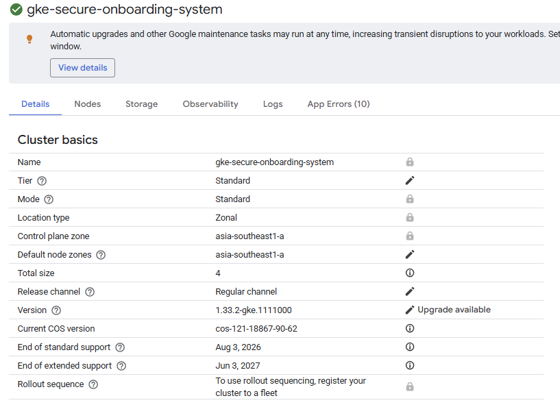
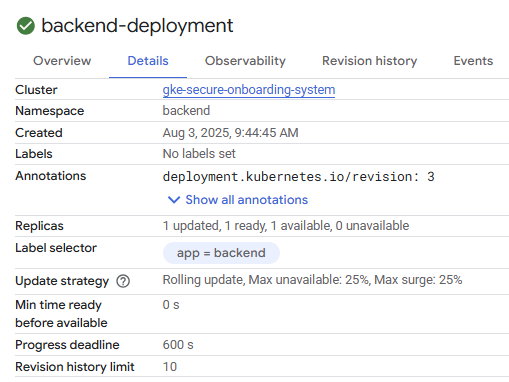
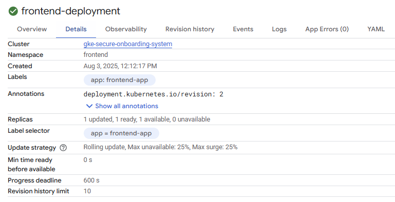
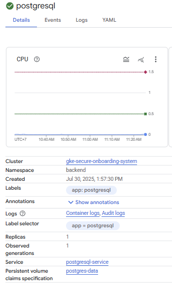
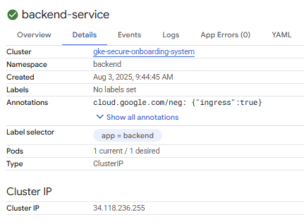
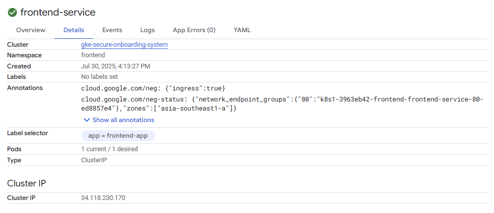
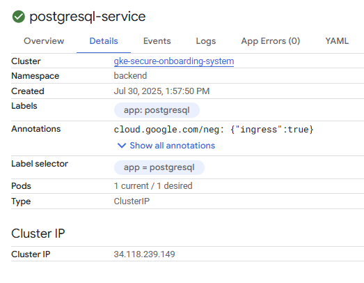
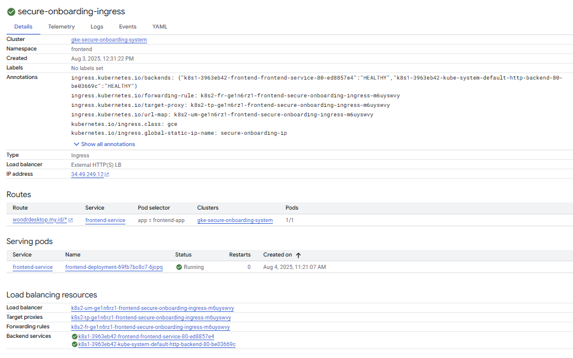
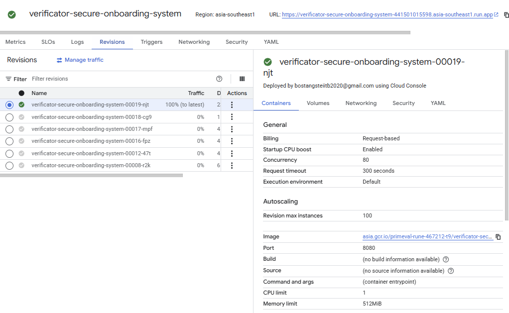
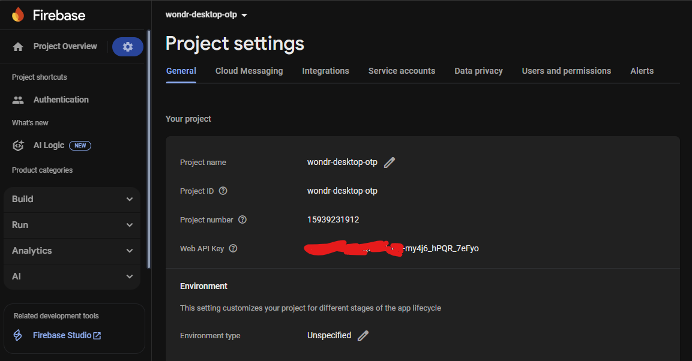

# Laporan Dokumentasi Deployment

Dokumen ini menjelaskan arsitektur dan konfigurasi *deployment* aplikasi "Wondr Desktop" ke lingkungan produksi, yang menggunakan Google Kubernetes Engine (GKE) dan layanan Google Cloud lainnya.

## 1. Arsitektur Aplikasi

Aplikasi "Wondr Desktop" terdiri dari empat komponen utama yang terpisah dalam direktori *root* proyek:

* **backend-secure-onboarding-system**: Layanan *backend* utama.
* **frontend-secure-onboarding-system**: Aplikasi *frontend* berbasis web.
* **ops-secure-onboarding-system**: Direktori untuk konfigurasi operasional.
* **verificator-secure-onboarding-system**: Layanan verifikasi pihak ketiga.

```tree
.
├── backend-secure-onboarding-system
├── frontend-secure-onboarding-system
├── ops-secure-onboarding-system
└── verificator-secure-onboarding-system
````

### 1.1 Struktur Backend & Frontend

Struktur folder **backend** menunjukkan arsitektur Spring Boot dengan fokus pada layanan otentikasi, registrasi, dan verifikasi.

```tree
.
├── Dockerfile
├── alert-rules.yml
├── alertmanager.yml
├── mvnw
├── pom.xml
├── prometheus.yml
src
 ├── main
 │   ├── java
 │   │   └── com
 │   │       └── reg
 │   │           └── regis
 │   │               ├── RegistrationAbsoluteApplication.java
 │   │               ├── client
 │   │               │   └── DukcapilWebClient.java
 │   │               ├── config
 │   │               │   ├── DukcapilClientConfig.java
 │   │               │   ├── OtpConfig.java
 │   │               │   ├── RateLimitConfig.java
 │   │               │   ├── SecurityConfig.java
 │   │               │   ├── SwaggerConfig.java
 │   │               │   └── WebConfig.java
 │   │               ├── controller
 │   │               │   ├── LoginController.java
 │   │               │   ├── OtpController.java
 │   │               │   ├── RegistrationController.java
 │   │               │   └── VerificationController.java
 │   │               ├── dto
 │   │               │   ├── request
 │   │               │   │   ├── DukcapilRequestDto.java
 │   │               │   │   ├── EmailVerificationRequest.java
 │   │               │   │   ├── NikVerificationRequest.java
 │   │               │   │   ├── PhoneVerificationRequest.java
 │   │               │   │   └── RegistrationRequest.java
 │   │               │   └── response
 │   │               │       ├── DukcapilResponseDto.java
 │   │               │       ├── RegistrationResponse.java
 │   │               │       └── VerificationResponse.java
 │   │               ├── model
 │   │               │   ├── Alamat.java
 │   │               │   ├── Customer.java
 │   │               │   └── Wali.java
 │   │               ├── repository
 │   │               │   └── CustomerRepository.java
 │   │               ├── security
 │   │               │   ├── JwtAuthFilter.java
 │   │               │   ├── JwtUtil.java
 │   │               │   └── SecurityUtil.java
 │   │               └── service
 │   │                   ├── CustomerUserDetailsService.java
 │   │                   ├── DukcapilClientService.java
 │   │                   ├── LoginAttemptService.java
 │   │                   ├── RegistrationService.java
 │   │                   └── VerificationService.java
 │   └── resources
 │       └── application.properties
 └── test
     ├── java
     │   └── com
     │       └── reg
     │           └── regis
     │               ├── TestSummary.md
     │               ├── controller
     │               │   ├── LoginControllerTest.java
     │               │   ├── RegistrationControllerTest.java
     │               │   └── VerificationControllerTest.java
     │               ├── dto
     │               │   ├── request
     │               │   │   ├── DukcapilRequestDtoTest.java
     │               │   │   ├── EmailVerificationRequestTest.java
     │               │   │   ├── NikVerificationRequestTest.java
     │               │   │   ├── PhoneVerificationRequestTest.java
     │               │   │   └── RegistrationRequestTest.java
     │               │   └── response
     │               │       ├── DukcapilResponseDtoTest.java
     │               │       ├── RegistrationResponseTest.java
     │               │       └── VerificationResponseTest.java
     │               ├── model
     │               │   ├── AlamatTest.java
     │               │   ├── CustomerTest.java
     │               │   └── WaliTest.java
     │               ├── repository
     │               │   └── CustomerRepositoryTest.java
     │               ├── security
     │               │   ├── JwtAuthFilterTest.java
     │               │   ├── JwtUtilTest.java
     │               │   └── SecurityUtilTest.java
     │               └── service
     │                   ├── CustomerUserDetailsServiceTest.java
     │                   ├── DukcapilClientServiceTest.java
     │                   ├── LoginAttemptServiceTest.java
     │                   ├── RegistrationServiceTest.java
     │                   └── VerificationServiceTest.java
     └── resources
         └── application-test.properties
```

Struktur folder **frontend** menggunakan React dengan Vite. Konfigurasi Nginx disertakan untuk melayani aplikasi statis.

```tree
.
├── Dockerfile
├── eslint.config.js
├── index.html
├── nginx
│   └── default.conf
├── package-lock.json
├── package.json
├── public
│   ├── index.html
│   ├── vite.svg
│   └── wondr-logo.png
├── src
│   ├── App.jsx
│   ├── Dashboard
│   │   ├── Dashboard.jsx
│   │   └── Dashboard.module.css
│   ├── Login
│   │   ├── LoginForm.jsx
│   │   └── LoginForm.module.css
│   ├── assets
│   │   ├── Dashboard.png
│   │   ├── ...
│   │   └── wondr.png
│   ├── components
│   │   ├── PasswordForm.jsx
│   │   ├── ...
│   │   └── undang.pdf
│   ├── context
│   │   ├── RegisterContext.jsx
│   │   └── formContext.jsx
│   ├── firebase.js
│   ├── index.css
│   ├── main.jsx
│   ├── pages
│   │   ├── AccountConfirmation.jsx
│   │   ├── AddressInputPage.jsx
│   │   ├── CreatePassword.css
│   │   ├── CreatePasswordPage.jsx
│   │   ├── EKTPVerification.css
│   │   ├── EKTPVerificationPage.jsx
│   │   ├── EmailInput.css
│   │   ├── Home.css
│   │   ├── Home.jsx
│   │   ├── JenisKartuPage.css
│   │   ├── JenisKartuPage.jsx
│   │   ├── JenisTabunganPage.css
│   │   ├── JenisTabunganPage.jsx
│   │   ├── JumlahGaji.jsx
│   │   ├── MotherName.css
│   │   ├── MotherNamePage.jsx
│   │   ├── OccupationPage.jsx
│   │   ├── PenghasilanPage.jsx
│   │   ├── PersonalDataForm.css
│   │   ├── PersonalDataForm.jsx
│   │   ├── PhoneInputPage.css
│   │   ├── PhoneInputPage.jsx
│   │   ├── WaliIdentity.css
│   │   ├── WondrLanding.css
│   │   ├── WondrLanding.jsx
│   │   ├── address.css
│   │   ├── emailInputPage.jsx
│   │   ├── nameInput.css
│   │   ├── nameInputPage.jsx
│   │   ├── phoneOtpInputPage.css
│   │   ├── phoneOtpInputPage.jsx
│   │   ├── termsCondition.jsx
│   │   ├── termsConditions.module.css
│   │   ├── tujuanPembukaanRekening.jsx
│   │   ├── undang.jsx
│   │   ├── undang.module.css
│   │   ├── waliFormPages.css
│   │   ├── waliIdentityPage.jsx
│   │   └── waliPage.jsx
│   └── utils
│       ├── sanitize.js
│       └── validation.js
├── vite.config.js
└── wondr-logo.png
```

## 2\. Infrastruktur Deployment

Aplikasi ini di-deploy menggunakan kombinasi GKE, Cloud Run, dan Cloud SQL untuk memastikan skalabilitas, efisiensi, dan manajemen yang mudah.

### 2.1 Google Kubernetes Engine (GKE)

* **Nama Cluster**: `gke-secure-onboarding-system`
* **Spesifikasi**:
  * **Tipe**: `Autopilot` (secara otomatis mengelola node dan pods).
  * **Versi**: `1.28.6-gke.1130000`.
  * **Lokasi**: `asia-southeast1-a` (Jakarta).
* **Deskripsi**: Cluster GKE digunakan untuk menampung *deployment* `backend-secure-onboarding-system` dan `frontend-secure-onboarding-system` serta database PostgreSQL.

### 2.2 Komunikasi Antar-Komponen dalam Cluster

* **Namespace**: *Deployment* dipisahkan ke dalam *namespace* `frontend` dan `backend`. Database PostgreSQL berada di *namespace* `backend`.
* **Network Policy**: Komunikasi antar *namespace* diatur dengan `NetworkPolicy`. Berikut adalah kebijakan yang memungkinkan *traffic* dari *namespace* `frontend` ke *service backend* dengan port `8080`.

    ```yaml
    apiVersion: networking.k8s.io/v1
    kind: NetworkPolicy
    metadata:
      name: allow-frontend-to-backend
      namespace: backend
    spec:
      podSelector:
        matchLabels:
          app: backend
      policyTypes:
      - Ingress
      ingress:
      - from:
        - namespaceSelector:
            matchLabels:
              name: frontend-app
          podSelector:
            matchLabels:
              app: frontend-app
        ports:
        - protocol: TCP
          port: 8080
    ```

### 2.3 Deployment & Service Kubernetes

**a. Backend Deployment**

* **Nama**: `backend-secure-onboarding-system-deployment`.
* **Replicas**: 2.
* **Image**: `asia.gcr.io/primeval-rune-467212-t9/wondr-desktop-be:1.0`.
* **Service**: `backend-service` (Tipe: `ClusterIP`) yang mengekspos port `8080` untuk komunikasi internal.

**b. Frontend Deployment**

* **Nama**: `frontend-secure-onboarding-system-deployment`.
* **Replicas**: 2.
* **Image**: `asia.gcr.io/primeval-rune-467212-t9/wondr-desktop-fe:1.0`.
* **Service**: `frontend-service` (Tipe: `NodePort`) yang mengekspos port `80` untuk diakses melalui Ingress.

**c. Database Deployment**

* **Nama**: `postgresql-deployment`.
* **Image**: `postgres:13.3-alpine`.
* **Service**: `postgresql-service` (Tipe: `ClusterIP`) untuk akses internal dari *backend*.

### 2.4 Ingress

* **Nama**: `secure-onboarding-ingress`.
* **Namespace**: `frontend`.
* **Konfigurasi**: Menggunakan Ingress GCE dengan IP statis global bernama `secure-onboarding-ip`.
* **Tujuan**: Meneruskan semua *traffic* dari domain `wondrdesktop.my.id` ke `frontend-service` pada port `80`.

### 2.5 Layanan Eksternal

Aplikasi ini menggunakan layanan eksternal untuk fungsionalitas tertentu:

* **Verifikasi OTP SMS**: Menggunakan layanan dari **Firebase Auth**.

* **Verifikator Dukcapil**: Layanan ini di-*deploy* sebagai **Cloud Run Service** dengan **Cloud SQL** sebagai databasenya. Hal ini dilakukan untuk memisahkan layanan yang spesifik dari *cluster* utama, memastikan skalabilitas yang lebih baik untuk layanan yang sifatnya terisolasi.

  * **Nama Layanan**: `verificator-secure-onboarding-system`
  * **Endpoint**: `https://verificator-secure-onboarding-system-441501015598.asia-southeast1.run.app`

## Informasi Detail

informasi detail dari gke-cluster :



informasi `backend-deployment`:



infromasi `frontend-deployment`:



informasi `postgresql-deployment`:



informasi `backend-service`:



informasi `frontend-service`:



informasi `postgresql-service`:



informasi `secure-onboarding-ingress`:



informasi service `verificator-secure-onboarding-system` :



informasi `wondr-desktop-otp`:


