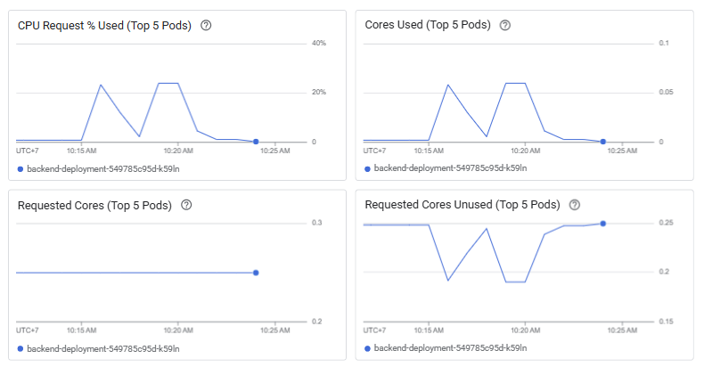
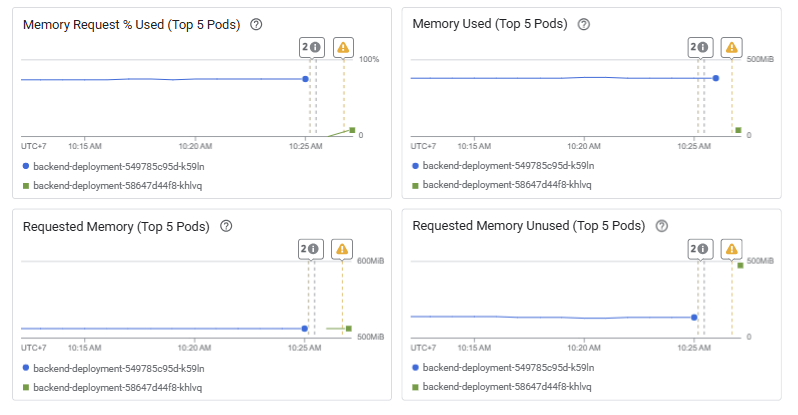
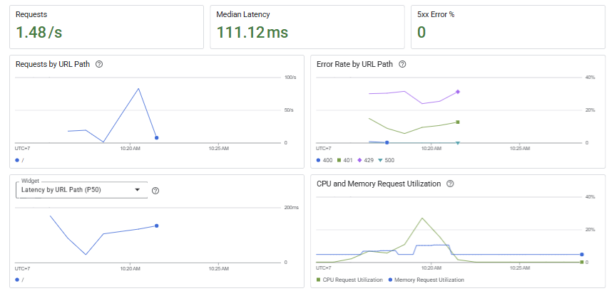
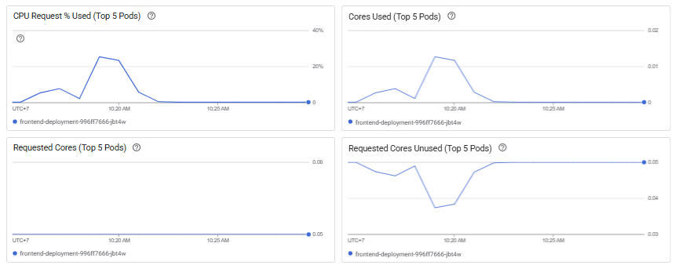
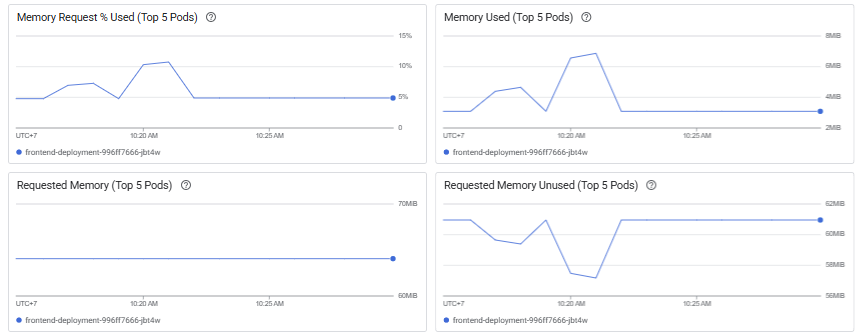

# Laporan Pengujian Performa

## Ringkasan Eksekutif

Laporan ini menyajikan hasil pengujian performa yang dilakukan pada aplikasi. Pengujian ini bertujuan untuk mengukur perilaku sistem di bawah beban, mengidentifikasi potensi *bottleneck*, dan memvalidasi stabilitas infrastruktur *backend* dan *frontend*. Pengujian dilakukan dengan mengirimkan sekitar 3000 *request* dalam waktu singkat untuk mensimulasikan lonjakan trafik.

Secara keseluruhan, sistem menunjukkan performa yang stabil. Baik *backend* maupun *frontend* dapat menangani beban yang diberikan dengan latensi yang relatif rendah dan tanpa menunjukkan tanda-tanda kegagalan signifikan, seperti peningkatan *error rate* yang tinggi. Analisis mendalam menunjukkan adanya fluktuasi pada pemakaian CPU, tetapi pemakaian memori tetap stabil.

## 1. Hasil Pengujian Backend

### Analisis Kinerja CPU

Ketika pengujian beban dilakukan dengan sekitar 3000 *request* dalam waktu singkat, terlihat peningkatan signifikan pada penggunaan CPU *backend*. Berdasarkan grafik **CPU Request % Used**, pemakaian CPU melonjak hingga sekitar **25%**. Puncak ini terjadi pada sekitar pukul 10:15 dan 10:20, yang bertepatan dengan periode beban tinggi.

Meskipun terjadi lonjakan, penggunaan CPU ini masih berada di bawah batas yang aman (biasanya 80-90% dianggap sebagai tanda peringatan) dan segera kembali normal setelah beban selesai. Hal ini menunjukkan bahwa *backend* mampu memproses *request* dengan efisien tanpa kehabisan sumber daya CPU.

### Analisis Kinerja Memori

Berbeda dengan CPU, pemakaian memori pada *backend* menunjukkan stabilitas yang sangat baik. Grafik **Memory Used** menunjukkan bahwa penggunaan memori relatif konstan dan tidak terpengaruh secara signifikan oleh lonjakan *request*.

Pada grafik **Memory Request % Used**, terlihat adanya penambahan satu *pod* baru (**backend-deployment-58647d44f8-khlvq**) pada sekitar pukul 10:25. Hal ini mengindikasikan adanya mekanisme *auto-scaling* yang bekerja untuk menambah kapasitas *backend* sebagai respons terhadap beban. Penambahan *pod* ini menunjukkan bahwa infrastruktur dirancang untuk skalabilitas, yang merupakan praktik yang baik dalam menangani trafik yang tidak terduga.

## 2. Hasil Pengujian Frontend

### Analisis Performa dan Latensi

Grafik **frontend-overview** menunjukkan performa *frontend* yang sehat selama pengujian:

* **Requests:** Tingkat *request* mencapai puncaknya pada 1.48 *request* per detik.
* **Median Latency:** Latensi median berada di angka **111.12ms**, yang merupakan angka yang sangat baik untuk pengalaman pengguna.
* **Error Rate:** Tidak ada *error* 5xx yang terdeteksi, yang menandakan stabilitas layanan. Terdapat beberapa *error* 4xx yang mungkin disebabkan oleh *request* yang tidak valid atau otentikasi.
* **Latency by URL Path (P50):** Latensi di jalur *root* (/) juga menunjukkan angka yang rendah dan stabil.

### Analisis Kinerja CPU Frontend

Sama seperti *backend*, *frontend* juga menunjukkan lonjakan pemakaian CPU saat pengujian. Grafik **CPU Request % Used** menunjukkan puncak penggunaan CPU mencapai sekitar **25%** pada sekitar pukul 10:20, lalu kembali normal. Ini menunjukkan bahwa *frontend* memiliki cukup sumber daya untuk merender dan melayani konten tanpa hambatan yang signifikan.

### Analisis Kinerja Memori Frontend

Penggunaan memori *frontend* juga relatif stabil. Grafik **Memory Used** menunjukkan fluktuasi minor, dengan penggunaan maksimal di bawah **10 MB**. Yang menarik adalah grafik **Requested Memory Unused** menunjukkan adanya penurunan pada waktu yang sama dengan lonjakan CPU. Ini bisa jadi karena sistem mengalokasikan memori yang dibutuhkan untuk sementara waktu, lalu mengembalikannya setelah beban mereda. Secara keseluruhan, memori *frontend* tidak menunjukkan adanya tanda-tanda *bottleneck*.

## 3. Kesimpulan & Rekomendasi

### Kesimpulan

Berdasarkan hasil pengujian, sistem menunjukkan performa yang baik dan stabil ketika dihadapkan pada lonjakan trafik. Baik *backend* maupun *frontend* mampu menangani sekitar 3000 *request* dengan latensi yang rendah dan *error rate* yang minimal. Peningkatan penggunaan CPU yang terjadi adalah perilaku yang wajar dan sumber daya kembali normal setelah beban selesai. Keberadaan mekanisme *auto-scaling* pada *backend* juga terdeteksi, menunjukkan bahwa infrastruktur dirancang dengan baik untuk skalabilitas.

### Rekomendasi

* **Pemantauan Berkelanjutan:** Meskipun performa saat ini baik, disarankan untuk terus memantau kinerja sistem di bawah skenario beban yang lebih ekstrem (misalnya, jumlah *request* yang lebih tinggi atau durasi yang lebih lama) untuk memastikan stabilitas jangka panjang.
* **Analisis Error 4xx:** Analisis lebih lanjut dapat dilakukan pada *error* 4xx yang terdeteksi untuk memastikan bahwa tidak ada masalah tersembunyi, seperti *endpoint* yang tidak berfungsi atau masalah otentikasi.
* **Optimalisasi Lebih Lanjut:** Meskipun tidak ada *bottleneck* yang jelas, tim dapat mempertimbangkan optimasi kode atau konfigurasi infrastruktur untuk menurunkan penggunaan CPU lebih lanjut jika diperlukan di masa depan.
